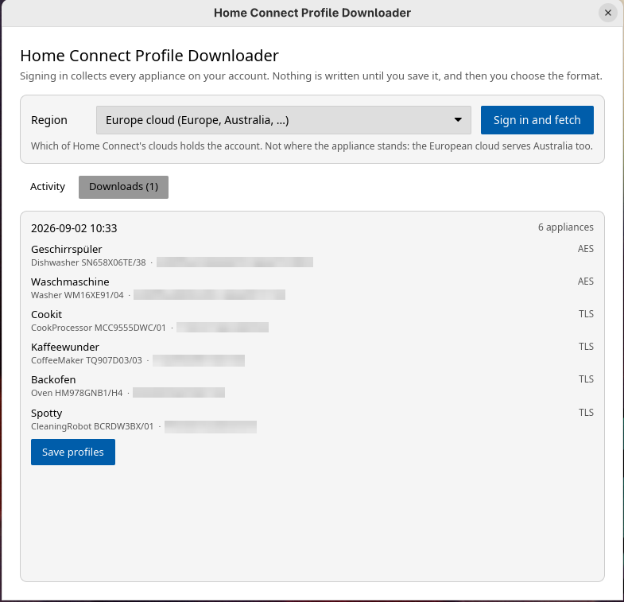

# Home Connect Profile Downloader

> [!NOTE]
> **This is the 2.0.0 beta, and it is a rewrite.** The application used to be built with Electron and is now written in Rust with a native interface. It does the same job and produces the same files, but it is packaged differently: an installer for Windows and a disk image for macOS, where there used to be a ZIP.
>
> Version 1 remains the released version. Its source is on the [`main` branch](https://github.com/bruestel/homeconnect-profile-downloader/tree/main), its packages are on the [releases page](https://github.com/bruestel/homeconnect-profile-downloader/releases), and it still receives security fixes.

This tool fetches profile information for all Home Connect devices linked to your account, enabling direct communication with your appliances over the local network.



## Why Use This Tool?

With the gathered profile information, you can directly communicate with your Home Connect devices within your home network. This is particularly useful for integrations such as the [Home Connect Direct binding for openHAB](https://community.openhab.org/t/home-connect-direct-binding-no-cloud/160857/36).

You sign in through the official Home Connect page, the tool collects every appliance on the account, and you decide afterwards what to save: a profile archive for the openHAB binding, a profile archive for Home Assistant, or a configuration file for [hcpy](https://github.com/hcpy2-0/hcpy). Nothing is written to disk until you ask for it.

## Install it

> **Note:** Download the package that matches your processor. Files labelled `amd64`, `x86_64` or `intel` are for 64-bit Intel and AMD machines, files labelled `arm64`, `aarch64` or `apple-silicon` for 64-bit ARM machines. On a Mac, the Apple menu under "About This Mac" tells you which one you have.

### On Linux

#### Debian, Ubuntu, Linux Mint

```bash
sudo dpkg -i hcpd_2.0.0~beta.1-1_amd64.deb
```

Then start **Home Connect Profile Downloader** from the application menu, or run `hcpd` in a terminal.

#### Fedora, RHEL, CentOS, openSUSE

```bash
sudo rpm -i hcpd-2.0.0~beta.1-1.x86_64.rpm
```

> **Note:** The tilde in the deb and rpm names is not a typo. Neither format allows the hyphen that semver uses for a pre-release, and both sort a tilde before everything else, so `2.0.0~beta.1` correctly counts as older than `2.0.0`.

#### Arch Linux

The `PKGBUILD` lives in this repository, under `packaging/aur/`:

```bash
git clone https://github.com/bruestel/homeconnect-profile-downloader.git
cd homeconnect-profile-downloader/packaging/aur
makepkg -si
```

#### AppImage

An AppImage runs without being installed.

```bash
chmod +x Home_Connect_Profile_Downloader-2.0.0-beta.1-x86_64.AppImage
./Home_Connect_Profile_Downloader-2.0.0-beta.1-x86_64.AppImage
```

It carries its own copy of everything except the system's WebKit, which the sign-in window needs. On a distribution that does not ship `webkit2gtk-4.1`, install it from the distribution's own packages, or use the deb or the rpm instead.

### On Windows

1. Download `hcpd-2.0.0-beta.1-windows-x86_64-setup.exe`.
2. Double-click it. The installer needs no administrator rights and installs for the current user only, under `%LOCALAPPDATA%\Programs\hcpd`.
3. Windows Defender SmartScreen will say that it protected your PC, because the installer is not signed by a paying developer. Click **More info**, then **Run anyway**.
4. Start **Home Connect Profile Downloader** from the Start menu.

To remove it later, use Settings, Apps, Installed apps, or the uninstaller in the installation folder.

### On macOS

1. Download `hcpd-2.0.0-beta.1-macos-apple-silicon.dmg` on an Apple silicon Mac, or `hcpd-2.0.0-beta.1-macos-intel.dmg` on an Intel Mac.
2. Open the disk image and drag **Home Connect Profile Downloader** onto the **Applications** folder, then eject the image.
3. Open the application from the Applications folder. macOS will refuse, saying it cannot verify that the app is free of malware.
4. Open **System Settings**, go to **Privacy & Security**, and scroll to the bottom. A line about the blocked application is there with an **Open Anyway** button. Click it and confirm.

The application starts normally from then on.

The reason is that releases carry an ad-hoc signature rather than a paid Apple Developer ID, and they are not notarised. macOS applies this check to anything carrying the quarantine mark that browsers and mail clients attach to downloads, so it appears once per download and not at all for a copy that arrives by other means.

If you would rather not go through System Settings, the same thing can be done in a terminal, and the drag-and-drop step is unchanged:

```bash
xattr -dr com.apple.quarantine "/Applications/Home Connect Profile Downloader.app"
```

Note that the right-click, **Open** trick that older instructions mention no longer works reliably on macOS 14 and later.

## Using it

1. Pick the Home Connect cloud your account belongs to. This is where the account was registered, which is not necessarily where you or the appliances are. If you pick the wrong one, the tool says so after signing in and offers the other.
2. Sign in. A separate window opens the official Home Connect page, which hands over to SingleKey ID. The tool never sees your password: it waits for the redirect at the end and takes the authorisation code from it.
3. Watch the activity list. Each step can be unfolded for the details, and a step that produced a warning stays unfolded.
4. Open **Downloads**, choose an appliance, and save. Only then are you asked for the format and the destination, and only then is anything written.

## Build it from source

The application is a Rust workspace and needs no Node.js.

### Prerequisites

A Rust toolchain, from [rustup.rs](https://rustup.rs) or from your distribution.

On Linux the sign-in window uses the system WebKit, so its development files have to be present:

```bash
# Debian, Ubuntu
sudo apt install libwebkit2gtk-4.1-dev libsoup-3.0-dev libxkbcommon-dev libwayland-dev

# Fedora
sudo dnf install webkit2gtk4.1-devel libsoup3-devel libxkbcommon-devel wayland-devel

# Arch
sudo pacman -S --needed webkit2gtk-4.1 libsoup3 libxkbcommon wayland
```

macOS and Windows need nothing beyond the toolchain: both carry the webview that the sign-in uses.

### Quick start

```bash
git clone https://github.com/bruestel/homeconnect-profile-downloader.git
cd homeconnect-profile-downloader
cargo build --release --workspace
./target/release/hcpd
```

Build the whole workspace rather than the application alone. The sign-in runs in a second executable, `hcpd-login`, and the application looks for it next to itself, so `cargo run -p hcpd` on its own gives you a build whose sign-in cannot start.

The workspace holds four crates: `app` is the interface, `login-helper` is the sign-in process, and `hcpd-core` and `hcpd-client` hold the profile documents and the API calls.

Tests, lints and formatting are what CI checks:

```bash
cargo test --workspace
cargo clippy --workspace --all-targets -- -D warnings
cargo fmt --all --check
```

Notes on packaging each platform are in [`packaging/README.md`](packaging/README.md).
